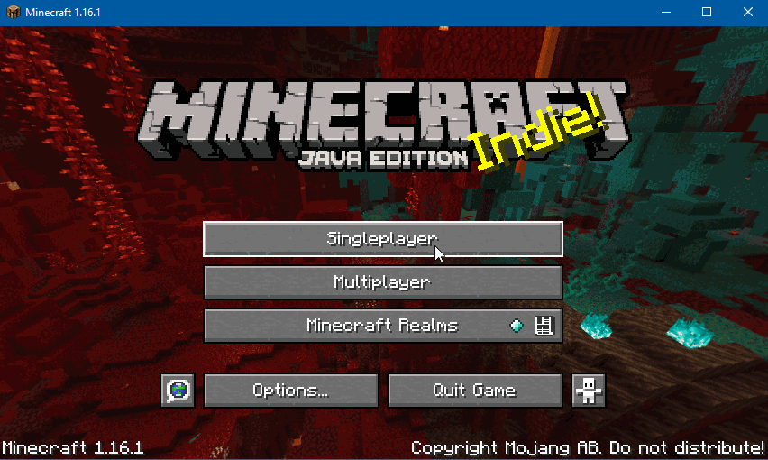

# Netherspawn

This is a datapack for Minecraft 1.16 that spawns the player into the nether at one of the ruined portals.

_Will you thrive in the nether, or strive to escape it!_

This datapack is currently in alpha and needs some more play testing. Please try it and give your feedback.

## Features

 * New players spawn at the closest ruined portal to 0,0 in the nether
 * Players without valid beds or respawn anchors respawn at the ruined portal
 * Each time a player respawns (i.e. not the initial spawn) at the ruined portal it degrades
 * If the ruined portal is let decay too far the next clostest portal will be used

## Usage

Requires Minecraft 1.16.

Add the datapack when creating a new world. See the GIF below. Enjoy.

## Known issues

The following is a list of known issues, if you encounter these feel free to let me know so I know which ones to fix first.

 * In single player worlds the player can see the overworld before they are spawned in the nether if the closest ruined portal to 0,0 has no suitable spawning locations
 * If a ruined portal degrades so far that there are no valid spawning locations the player can still spawn there once more before being spawned at the next closest portal
 * If players have a bed or respawn anchor but are not able to respawn at it they can breifly see the overworld before being respawned at the ruined portal
 * If the pack has to search through too many ruined portals performance can get very slow as it leaves behind force loaded chunks

## TODO

 * Clean up the code, use consistent naming patterns
 * Clean up force loaded chunks when not required
 * Improve the portal search algorithm to allow checking more than one ruined portal per tick
 * Add custom sound effects when portal blocks degrade or break
